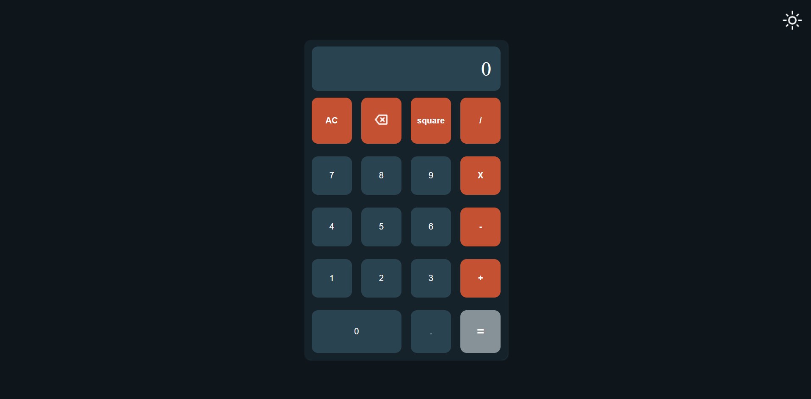
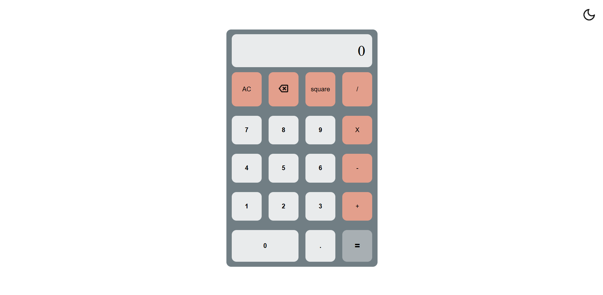

# Themeable JS Calculator

A responsive JavaScript calcultor built with HTML, CSS, and vanilla JavaScript. Includes both Dark and Light themes with a theme toggle switch.

## ✨ Features

- Basic arithmetic operations
- Square function
- Prevents consecutive operators
- Error handling for invalid expressions
- Responsive design
- Dark/Light mode

## 📸 Screenshots

## 🛠️ Tech Stack

- HTML
- CSS
- JavaScript

## 🚀 Future Improvements

- Replace eval()
- Block Multiple Decimals like 5.6.7

# 📦 How to Use

1. Clone the repo
2. Open index.html in your browser
3. Toggle theme using the switch in the top-right corner
4. Perform calculations by clicking buttons

---

> Created by Shashwat
